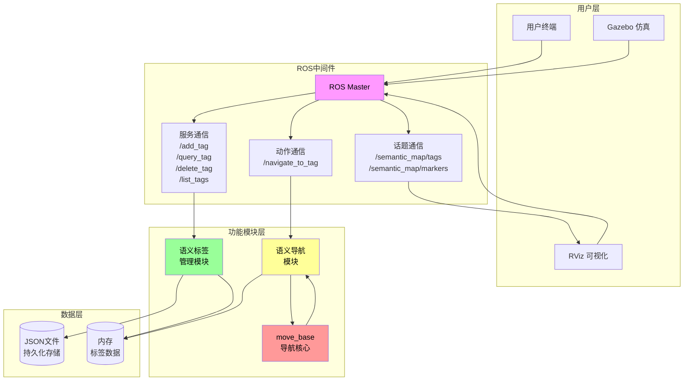
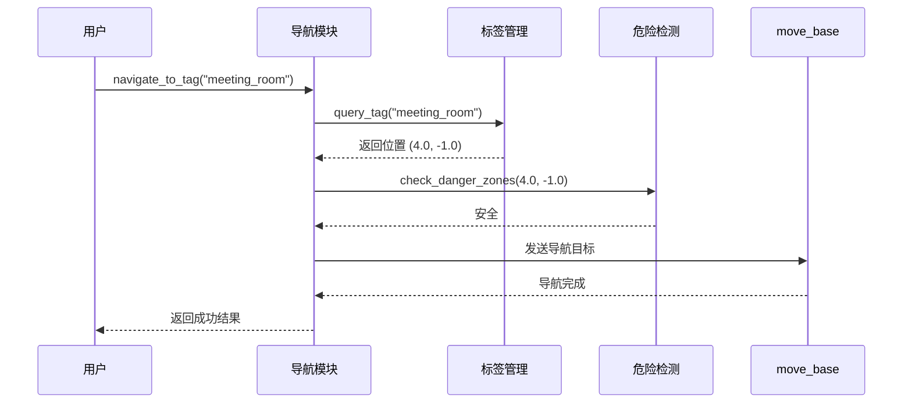
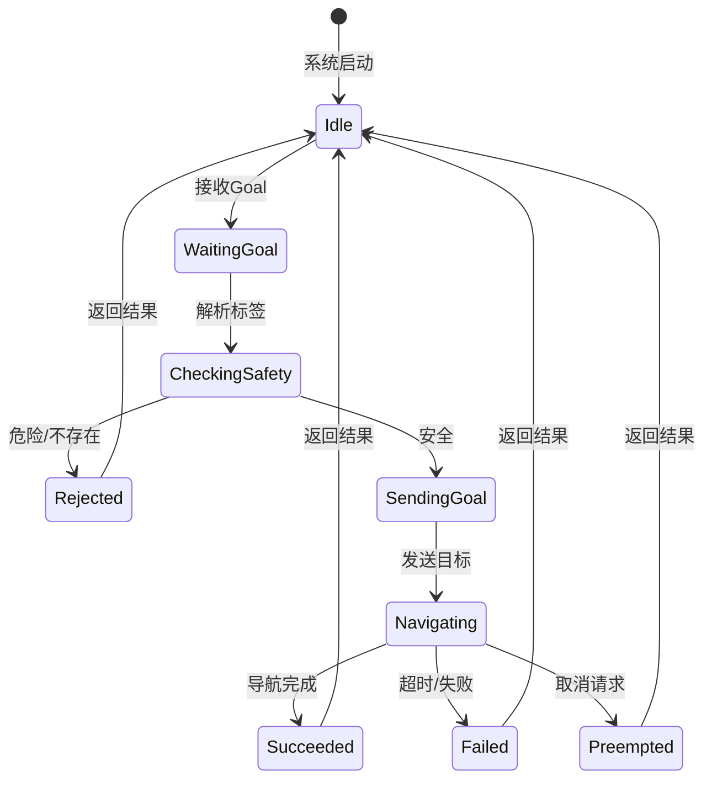

# 图表集 - 语义地图构建与目标导航系统

本文档包含论文中使用的所有图表的源代码，支持多种渲染格式。

---

## 图3.1 系统总体架构图

### ASCII Art版本

```
┌─────────────────────────────────────────────────────────────────────────────────────┐
│                          语义地图构建与目标导航系统架构                                │
├─────────────────────────────────────────────────────────────────────────────────────┤
│                                                                                      │
│    ┌──────────────┐     ┌──────────────┐     ┌──────────────┐                      │
│    │   用户终端    │     │    RViz      │     │   Gazebo     │                      │
│    │  (RViz/GUI)  │     │  可视化界面   │     │   仿真环境   │                      │
│    └──────┬───────┘     └──────┬───────┘     └──────┬───────┘                      │
│           │                    │                    │                               │
│           │                    │                    │                               │
│           ▼                    ▼                    ▼                               │
│    ┌─────────────────────────────────────────────────────────────────────┐          │
│    │                        ROS 通信中间件 (ROS Master)                      │          │
│    │                                                                      │          │
│    │   话题 (Topic)           服务 (Service)          动作 (Action)       │          │
│    │   • /semantic_map/tags  • /semantic_map/add_tag  • /navigate_to_tag │          │
│    │   • /semantic_map/      • /semantic_map/         •                  │          │
│    │     markers               query_tag                                  │          │
│    │                         • /semantic_map/                            │          │
│    │                           delete_tag                                │          │
│    │                         • /semantic_map/                            │          │
│    │                           list_tags                                 │          │
│    └─────────────────────────────────────────────────────────────────────┘          │
│           │                    │                    │                               │
│           ▼                    ▼                    ▼                               │
│    ┌──────────────┐     ┌──────────────┐     ┌──────────────┐                      │
│    │   语义标签    │     │   语义导航    │     │   move_base   │                      │
│    │   管理模块    │     │    模块      │     │   导航核心    │                      │
│    │              │     │              │     │              │                      │
│    │ • 标签CRUD   │     │ • 目标查询    │     │ • 全局规划    │                      │
│    │ • 持久化     │────▶│ • 危险检测    │────▶│ • 局部规划    │                      │
│    │ • 自动保存   │     │ • Action交互  │     │ • 运动控制    │                      │
│    └──────┬───────┘     └──────┬───────┘     └──────┬───────┘                      │
│           │                    │                    │                               │
│           ▼                    │                    │                               │
│    ┌──────────────┐            │                    │                               │
│    │   JSON文件    │            │                    │                               │
│    │   存储层      │            │                    │                               │
│    └──────────────┘            │                    │                               │
│                                │                    │                               │
│                         ┌──────┴───────┐             │                               │
│                         │  语义标签     │             │                               │
│                         │  数据库      │             │                               │
│                         │  (内存)      │◀────────────┘                               │
│                         └─────────────┘                                              │
│                                                                                      │
└─────────────────────────────────────────────────────────────────────────────────────┘
```

### Mermaid版本



---

## 图3.2 系统数据流图

```
┌──────────────────────────────────────────────────────────────────────────────┐
│                              数据流图                                        │
├──────────────────────────────────────────────────────────────────────────────┤
│                                                                              │
│  用户端                                                                     │
│    │                                                                        │
│    ▼                                                                        │
│  ┌─────────────┐                                                            │
│  │ 标签操作请求 │  Add/Query/Delete/List                                    │
│  └──────┬──────┘                                                            │
│         │                                                                   │
│         ▼                                                                   │
│  ┌─────────────────────────────────────────────────────────────────┐        │
│  │                     语义标签管理模块                               │        │
│  │  ┌─────────┐    ┌─────────┐    ┌─────────┐    ┌─────────┐      │        │
│  │  │ ADD标签  │    │QUERY标签│    │DELETE标签│    │LIST标签 │      │        │
│  │  └────┬────┘    └────┬────┘    └────┬────┘    └────┬────┘      │        │
│  │       │              │              │              │            │        │
│  │       ▼              ▼              ▼              ▼            │        │
│  │  ┌─────────────────────────────────────────────────────────┐   │        │
│  │  │              数据一致性检查 (threading.Lock)            │   │        │
│  │  └─────────────────────────────────────────────────────────┘   │        │
│  │                         │                                      │        │
│  │                         ▼                                      │        │
│  │  ┌──────────────────┐  │  ┌──────────────────┐                 │        │
│  │  │    内存数据       │◀─┴─▶│    JSON文件      │                 │        │
│  │  │  (self.tags)     │     │  (持久化存储)    │                 │        │
│  │  └──────────────────┘     └──────────────────┘                 │        │
│  │                         │                                      │        │
│  │                         ▼ (自动保存/手动保存)                    │        │
│  └─────────────────────────────────────────────────────────────────┘        │
│                                                                              │
│                         │                                                   │
│                         ▼ (标签发布 /semantic_map/tags)                      │
│  ┌─────────────────────────────────────────────────────────────────┐        │
│  │                       可视化模块                                  │        │
│  │  ┌─────────────────────────────────────────────────────────┐   │        │
│  │  │                   标签解析与转换                          │   │        │
│  │  └─────────────────────────────────────────────────────────┘   │        │
│  │                         │                                      │        │
│  │                         ▼                                      │        │
│  │  ┌─────────────────────────────────────────────────────────┐   │        │
│  │  │           MarkerArray 生成 (球体/箭头/文字/圆柱体)         │   │        │
│  │  └─────────────────────────────────────────────────────────┘   │        │
│  │                         │                                      │        │
│  │                         ▼ (发布 /semantic_map/markers)          │        │
│  └─────────────────────────────────────────────────────────────────┘        │
│                                                                              │
│                         │                                                   │
│                         ▼ (标签查询)                                          │
│  ┌─────────────────────────────────────────────────────────────────┐        │
│  │                       导航模块                                    │        │
│  │  ┌─────────────────────────────────────────────────────────┐   │        │
│  │  │                   目标标签解析                           │   │        │
│  │  └─────────────────────────────────────────────────────────┘   │        │
│  │                         │                                      │        │
│  │                         ▼                                      │        │
│  │  ┌─────────────────────────────────────────────────────────┐   │        │
│  │  │              危险区域检测 (距离计算)                      │   │        │
│  │  └─────────────────────────────────────────────────────────┘   │        │
│  │                    │              │                            │        │
│  │           ┌────────┘              └────────┐                   │        │
│  │           ▼                                  ▼                   │        │
│  │  ┌─────────────────┐            ┌─────────────────┐           │        │
│  │  │   安全 → 继续    │            │  危险 → 拒绝     │           │        │
│  │  └────────┬────────┘            └────────┬────────┘           │        │
│  │           │                                  │                   │        │
│  │           ▼                                  │                   │        │
│  │  ┌─────────────────────────────────┐        │                   │        │
│  │  │     move_base Action 调用       │        │                   │        │
│  │  │     (发送导航目标)               │        │                   │        │
│  │  └────────┬────────────────────────┘        │                   │        │
│  │           │                                  │                   │        │
│  │           ▼                                  │                   │        │
│  │  ┌─────────────────────────────────┐        │                   │        │
│  │  │     导航状态反馈 (Feedback)       │        │                   │        │
│  │  └────────┬────────────────────────┘        │                   │        │
│  │           │                                  │                   │        │
│  │           ▼                                  │                   │        │
│  │  ┌─────────────────────────────────┐        │                   │        │
│  │  │     导航结果返回 (Result)         │        │                   │        │
│  │  └─────────────────────────────────┘        │                   │        │
│  └─────────────────────────────────────────────────────────────────┘        │
│                                                                              │
└──────────────────────────────────────────────────────────────────────────────┘
```

---

## 图4.1 语义标签管理模块流程图

```
┌──────────────────────────────────────────────────────────────────────────────┐
│                        语义标签管理模块流程图                                  │
├──────────────────────────────────────────────────────────────────────────────┤
│                                                                              │
│                           ┌─────────────────┐                                 │
│                           │     开始        │                                 │
│                           └────────┬────────┘                                 │
│                                    │                                          │
│                                    ▼                                          │
│                           ┌─────────────────┐                                 │
│                           │  节点初始化     │                                 │
│                           │  • 加载配置     │                                 │
│                           │  • 加载标签数据 │                                 │
│                           │  • 初始化锁     │                                 │
│                           └────────┬────────┘                                 │
│                                    │                                          │
│                                    ▼                                          │
│                           ┌─────────────────┐                                 │
│                           │  创建服务        │                                 │
│                           │  Add/Query/      │                                 │
│                           │  Delete/List     │                                 │
│                           └────────┬────────┘                                 │
│                                    │                                          │
│                                    ▼                                          │
│    ┌────────────────────────────────────────────────────────────────────┐     │
│    │                     服务请求处理循环                                 │     │
│    │                                                                     │     │
│    │    ┌──────────────┐  ┌──────────────┐  ┌──────────────┐           │     │
│    │    │ AddSemanticTag│  │QuerySemanticTag│  │DeleteSemanticTag│         │     │
│    │    │   服务        │  │    服务       │  │    服务       │           │     │
│    │    └──────┬───────┘  └──────┬───────┘  └──────┬───────┘           │     │
│    │           │                 │                 │                    │     │
│    │           └────────────┬────┴────────┬────────┘                    │     │
│    │                        ▼             │                              │     │
│    │              ┌─────────────────┐    │                               │     │
│    │              │  获取请求参数     │    │                               │     │
│    │              └────────┬────────┘    │                               │     │
│    │                       │            │                               │     │
│    │                       ▼            ▼                               │     │
│    │              ┌─────────────────────────────────────┐               │     │
│    │              │         加锁 (threading.Lock)        │               │     │
│    │              └──────────────────┬──────────────────┘               │     │
│    │                                 │                                   │     │
│    │           ┌────────────────────┼────────────────────┐             │     │
│    │           ▼                    ▼                    ▼             │     │
│    │    ┌─────────────┐      ┌─────────────┐      ┌─────────────┐       │     │
│    │    │ 检查标签    │      │ 查询标签    │      │ 删除标签    │       │     │
│    │    │ 是否存在    │      │ 信息        │      │ 从内存     │       │     │
│    │    └──────┬─────┘      └──────┬─────┘      └──────┬─────┘       │     │
│    │           │                   │                   │              │     │
│    │           ▼                   ▼                   ▼              │     │
│    │    ┌─────────────┐      ┌─────────────┐      ┌─────────────┐       │     │
│    │    │ ADD: 添加   │      │ 返回标签    │      │ 删除标签    │       │     │
│    │    │ DELETE: 跳过│      │ 信息        │      │ 并返回成功 │       │     │
│    │    │ QUERY: 返回 │      │             │      │             │       │     │
│    │    │   错误      │      │             │      │             │       │     │
│    │    └──────┬─────┘      └──────┬─────┘      └──────┬─────┘       │     │
│    │           │                   │                   │              │     │
│    │           └──────────────────┼───────────────────┘              │     │
│    │                               ▼                                  │     │
│    │                    ┌─────────────────┐                         │     │
│    │                    │  解锁            │                         │     │
│    │                    └────────┬────────┘                         │     │
│    │                             │                                   │     │
│    │                             ▼                                   │     │
│    │              ┌─────────────────────────────┐                    │     │
│    │              │  发布标签更新 (/tags话题)    │                    │     │
│    │              └─────────────┬───────────────┘                    │     │
│    │                            │                                    │     │
│    └────────────────────────────┼────────────────────────────────────┘     │
│                                 │                                           │
│                                 ▼                                           │
│                        ┌─────────────────┐                                  │
│                        │  返回服务响应   │                                  │
│                        └────────┬────────┘                                  │
│                                 │                                          │
│                                 ▼                                          │
│    ┌────────────────────────────────────────────────────────────────────┐    │
│    │                     自动保存定时器 (30秒间隔)                         │    │
│    │                              │                                     │    │
│    │                              ▼                                     │    │
│    │                    ┌─────────────────┐                             │    │
│    │                    │ 检查数据是否有   │                             │    │
│    │                    │  更新           │                             │    │
│    │                    └────────┬────────┘                             │    │
│    │                             │                                     │    │
│    │              ┌──────────────┴──────────────┐                       │    │
│    │              ▼                             ▼                       │    │
│    │    ┌─────────────────┐          ┌─────────────────┐               │    │
│    │    │ 有更新 → 保存   │          │ 无更新 → 跳过   │               │    │
│    │    │ 到JSON文件     │          │                 │               │    │
│    │    └─────────────────┘          └─────────────────┘               │    │
│    └────────────────────────────────────────────────────────────────────┘    │
│                                                                              │
└──────────────────────────────────────────────────────────────────────────────┘
```

---

## 图4.2 语义导航模块流程图

```
┌──────────────────────────────────────────────────────────────────────────────┐
│                         语义导航模块流程图                                     │
├──────────────────────────────────────────────────────────────────────────────┤
│                                                                              │
│                           ┌─────────────────┐                                │
│                           │     开始        │                                │
│                           └────────┬────────┘                                │
│                                    │                                         │
│                                    ▼                                         │
│                           ┌─────────────────┐                                │
│                           │  节点初始化     │                                │
│                           │  • 初始化Action│                                │
│                           │    Server      │                                │
│                           │  • 连接move_base│                                │
│                           │    (可选)      │                                │
│                           │  • 设置参数     │                                │
│                           └────────┬────────┘                                │
│                                    │                                         │
│                                    ▼                                         │
│    ┌─────────────────────────────────────────────────────────────────────┐   │
│    │                    Action Goal接收                                  │   │
│    │                              │                                      │   │
│    │                              ▼                                      │   │
│    │                    ┌─────────────────┐                              │   │
│    │                    │ 接收目标标签名称  │                              │   │
│    │                    │ tag_name        │                              │   │
│    │                    └────────┬────────┘                              │   │
│    │                             │                                       │   │
│    │                             ▼                                       │   │
│    │                    ┌─────────────────┐                              │   │
│    │                    │ 查询标签信息    │                              │   │
│    │                    │ /query_tag服务  │                              │   │
│    │                    └────────┬────────┘                              │   │
│    │                             │                                       │   │
│    │                             ▼                                       │   │
│    │              ┌─────────────────────────────┐                       │   │
│    │              │      标签存在检查            │                       │   │
│    │              └─────────────┬───────────────┘                       │   │
│    │                            │                                        │   │
│    │              ┌─────────────┴─────────────┐                          │   │
│    │              ▼                           ▼                          │   │
│    │    ┌─────────────────┐         ┌─────────────────┐                │   │
│    │    │    不存在       │         │     存在       │                │   │
│    │    │  返回错误:      │         │  继续处理      │                │   │
│    │    │  "Tag not found"│         │                │                │   │
│    │    └────────┬────────┘         └────────┬────────┘                │   │
│    │             │                          │                         │   │
│    │             │                          ▼                         │   │
│    │             │              ┌─────────────────┐                   │   │
│    │             │              │ 获取标签位置    │                   │   │
│    │             │              │ (x, y, yaw)     │                   │   │
│    │             │              └────────┬────────┘                   │   │
│    │             │                       │                            │   │
│    │             │                       ▼                            │   │
│    │             │            ┌─────────────────┐                     │   │
│    │             │            │ 危险区域类型    │                     │   │
│    │             │            │ 检查            │                     │   │
│    │             │            └────────┬────────┘                     │   │
│    │             │                     │                              │   │
│    │             │        ┌────────────┴────────────┐                 │   │
│    │             │        ▼                         ▼                  │   │
│    │             │ ┌─────────────┐         ┌─────────────┐            │   │
│    │             │ │danger_zone │         │   其他类型   │            │   │
│    │             │ │  类型       │         │              │            │   │
│    │             │ └──────┬──────┘         └──────┬──────┘            │   │
│    │             │        │                       │                    │   │
│    │             │        ▼                       │                    │   │
│    │             │ ┌─────────────┐                │                    │   │
│    │             │ │ 拒绝导航    │                │                    │   │
│    │             │ │ 返回错误    │                │                    │   │
│    │             │ └────────┬────┘                │                    │   │
│    │             │          │                    │                    │   │
│    │             │          └──────────┬─────────┘                    │   │
│    │             │                     │                              │   │
│    │             │                     ▼                              │   │
│    │             │           ┌─────────────────┐                      │   │
│    │             │           │ 危险区域距离    │                      │   │
│    │             │           │ 检查            │                      │   │
│    │             │           │ (与所有danger_  │                      │   │
│    │             │           │  zone计算距离)  │                      │   │
│    │             │           └────────┬────────┘                      │   │
│    │             │                    │                               │   │
│    │             │        ┌───────────┴───────────┐                    │   │
│    │             │        ▼                       ▼                    │   │
│    │             │ ┌─────────────┐       ┌─────────────┐              │   │
│    │             │ │ 距离<阈值   │       │ 距离≥阈值   │              │   │
│    │             │ │ (1.0m)     │       │ (安全)      │              │   │
│    │             │ └──────┬─────┘       └──────┬──────┘              │   │
│    │             │        │                     │                     │   │
│    │             │        ▼                     │                     │   │
│    │             │ ┌─────────────┐              │                     │   │
│    │             │ │ 拒绝导航    │              │                     │   │
│    │             │ │ "Danger zone│              │                     │   │
│    │             │ │ proximity"  │              │                     │   │
│    │             │ └──────┬─────┘              │                     │   │
│    │             │        │                     │                     │   │
│    │             │        └──────────┬─────────┘                     │   │
│    │             │                   │                               │   │
│    │             │                   ▼                               │   │
│    │             │        ┌─────────────────┐                        │   │
│    │             │        │ 发布初始反馈    │                        │   │
│    │             │        │ progress = 0   │                        │   │
│    │             │        │ status =       │                        │   │
│    │             │        │ "Starting..."  │                        │   │
│    │             │        └────────┬────────┘                        │   │
│    │             │                 │                                 │   │
│    │             │                 ▼                                 │   │
│    │             │   ┌─────────────────────────┐                      │   │
│    │             │   │  模式判断               │                      │   │
│    │             │   │  simulation_mode?      │                      │   │
│    │             │   └───────────┬─────────────┘                      │   │
│    │             │               │                                    │   │
│    │             │   ┌───────────┴─────────────┐                       │   │
│    │             │   ▼                         ▼                       │   │
│    │             │ ┌───────────────┐   ┌───────────────┐              │   │
│    │             │ │ 模拟模式       │   │ 真实导航模式   │              │   │
│    │             │ │ (无move_base) │   │ (有move_base) │              │   │
│    │             │ └───────┬───────┘   └───────┬───────┘              │   │
│    │             │         │                   │                      │   │
│    │             │         ▼                   ▼                      │   │
│    │             │ ┌───────────────┐   ┌───────────────┐              │   │
│    │             │ │ 模拟导航      │   │ 发送MoveBase  │              │   │
│    │             │ │ 20步渐进     │   │ Goal到        │              │   │
│    │             │ │ 发布进度反馈 │   │ move_base     │              │   │
│    │             │ └───────┬───────┘   └───────┬───────┘              │   │
│    │             │         │                   │                      │   │
│    │             │         │                   ▼                      │   │
│    │             │         │         ┌───────────────┐              │   │
│    │             │         │         │ 等待导航结果  │              │   │
│    │             │         │         │ (超时检测)   │              │   │
│    │             │         │         └───────┬───────┘              │   │
│    │             │         │                 │                      │   │
│    │             │         │       ┌─────────┴─────────┐            │   │
│    │             │         │       ▼                   ▼            │   │
│    │             │         │  ┌─────────┐       ┌─────────┐         │   │
│    │             │         │  │ 超时   │       │ 正常返回 │         │   │
│    │             │         │  │ 取消Goal│       │         │         │   │
│    │             │         │  └────┬────┘       └────┬────┘         │   │
│    │             │         │       │                 │              │   │
│    │             │         │       └─────────┬───────┘              │   │
│    │             │         │                 │                      │   │
│    │             │         │                 ▼                      │   │
│    │             │         │        ┌───────────────┐              │   │
│    │             │         │        │ 发布最终Result │              │   │
│    │             │         │        │ success=true  │              │   │
│    │             │         │        │ final_x/y/yaw │              │   │
│    │             │         │        └───────┬───────┘              │   │
│    │             │         │                │                      │   │
│    │             │         │                ▼                      │   │
│    │             │         │        ┌───────────────┐              │   │
│    │             │         │        │ set_succeeded │              │   │
│    │             │         │        │ 或 set_aborted │              │   │
│    │             │         │        └───────────────┘              │   │
│    │             │         │                                           │   │
│    └─────────────┴─────────┴───────────────────────────────────────────┘   │
│                                                                              │
└──────────────────────────────────────────────────────────────────────────────┘
```

---

## 图4.3 可视化模块流程图

```
┌──────────────────────────────────────────────────────────────────────────────┐
│                         可视化模块流程图                                       │
├──────────────────────────────────────────────────────────────────────────────┤
│                                                                              │
│                           ┌─────────────────┐                                 │
│                           │     开始        │                                 │
│                           └────────┬────────┘                                 │
│                                    │                                          │
│                                    ▼                                          │
│                           ┌─────────────────┐                                 │
│                           │  节点初始化     │                                 │
│                           │  • 定义颜色映射 │                                 │
│                           │  • 创建订阅者   │                                 │
│                           │  • 创建发布者   │                                 │
│                           └────────┬────────┘                                 │
│                                    │                                          │
│                                    ▼                                          │
│    ┌─────────────────────────────────────────────────────────────────────┐    │
│    │                    标签话题消息接收 (/semantic_map/tags)               │    │
│    │                              │                                      │    │
│    │                              ▼                                      │    │
│    │                    ┌─────────────────┐                              │    │
│    │                    │ 解析JSON消息    │                              │    │
│    │                    │ 获取标签字典    │                              │    │
│    │                    └────────┬────────┘                              │    │
│    │                             │                                       │    │
│    │                             ▼                                       │    │
│    │                    ┌─────────────────┐                              │    │
│    │                    │ 清空标记列表    │                              │    │
│    │                    │ marker_array    │                              │    │
│    │                    └────────┬────────┘                              │    │
│    │                             │                                       │    │
│    │                             ▼                                       │    │
│    │              ┌───────────────────────────────────┐                  │    │
│    │              │       遍历所有标签                 │                  │    │
│    │              │       for tag in tags:           │                  │    │
│    │              └───────────────┬───────────────────┘                  │    │
│    │                              │                                       │    │
│    │                              ▼                                       │    │
│    │              ┌───────────────────────────────────┐                  │    │
│    │              │ 获取标签信息                       │                  │    │
│    │              │ • name • x, y, yaw               │                  │    │
│    │              │ • tag_type                        │                  │    │
│    │              └───────────────┬───────────────────┘                  │    │
│    │                              │                                       │    │
│    │                              ▼                                       │    │
│    │                    ┌─────────────────┐                              │    │
│    │                    │ 颜色映射查找    │                              │    │
│    │                    │ 根据tag_type    │                              │    │
│    │                    │ 获取RGB颜色    │                              │    │
│    │                    └────────┬────────┘                              │    │
│    │                             │                                       │    │
│    │                             ▼                                       │    │
│    │              ┌───────────────────────────────────┐                  │    │
│    │              │ 危险区域类型判断                   │                  │    │
│    │              │ if tag_type == "danger_zone"     │                  │    │
│    │              └───────────────┬───────────────────┘                  │    │
│    │                              │                                       │    │
│    │              ┌───────────────┴───────────────┐                      │    │
│    │              ▼                               ▼                      │    │
│    │    ┌─────────────────┐             ┌─────────────────┐              │    │
│    │    │    是危险区域    │             │   非危险区域    │              │    │
│    │    │  → 圆柱体标记   │             │  → 球体标记    │              │    │
│    │    └────────┬────────┘             └────────┬────────┘              │    │
│    │             │                               │                       │    │
│    │             │         ┌─────────────────────┴──────┐              │    │
│    │             │         │                           │              │    │
│    │             │         ▼                           ▼              │    │
│    │             │ ┌───────────────┐           ┌───────────────┐      │    │
│    │             │ │ 创建圆柱体    │           │ 创建球体标记   │      │    │
│    │             │ │ 标记         │           │               │      │    │
│    │             │ │ CYLINDER    │           │ SPHERE        │      │    │
│    │             │ │ • 红色      │           │ • 根据类型着色 │      │    │
│    │             │ │ • h=0.5m   │           │ • r=0.2m      │      │    │
│    │             │ │ • r=1.0m   │           │               │      │    │
│    │             │ └──────┬──────┘           └───────┬───────┘      │    │
│    │             │        │                          │               │    │
│    │             │        └──────────────┬───────────┘              │    │
│    │             │                       │                          │    │
│    │             │                       ▼                          │    │
│    │             │         ┌─────────────────────────┐              │    │
│    │             │         │  添加箭头标记 (朝向)     │              │    │
│    │             │         │  ARROW                  │              │    │
│    │             │         │  • 基于yaw角度          │              │    │
│    │             │         │  • 长度=0.5m           │              │    │
│    │             │         └───────────┬─────────────┘              │    │
│    │             │                     │                             │    │
│    │             │                     ▼                             │    │
│    │             │         ┌─────────────────────────┐              │    │
│    │             │         │  添加文字标记 (名称)     │              │    │
│    │             │         │  TEXT_VIEW_FACING       │              │    │
│    │             │         │  • 显示标签名称          │              │    │
│    │             │         │  • 显示类型图标          │              │    │
│    │             │         │  • 高度=0.5m           │              │    │
│    │             │         └───────────┬─────────────┘              │    │
│    │             │                     │                             │    │
│    │             │                     │                             │    │
│    │             │         ┌───────────┴─────────────┐              │    │
│    │             │         │                         │              │    │
│    │             │         │                         ▼              │    │
│    │             │         │              ┌─────────────────┐       │    │
│    │             │         │              │ 添加标记到列表  │       │    │
│    │             │         │              │ marker_array.   │       │    │
│    │             │         │              │ markers.append │       │    │
│    │             │         │              └────────┬────────┘       │    │
│    │             │         │                         │                │    │
│    │             │         │                         │                │    │
│    └─────────────┴─────────┴─────────────────────────┴────────────────┘    │
│                                                                              │
│                                    │                                          │
│                                    ▼                                          │
│                           ┌─────────────────┐                               │
│                           │ 发布MarkerArray │                               │
│                           │ /semantic_map/  │                               │
│                           │ markers         │                               │
│                           └────────┬────────┘                               │
│                                    │                                          │
│                                    ▼                                          │
│                           ┌─────────────────┐                               │
│                           │  返回等待下一条  │                               │
│                           │  消息           │                               │
│                           └─────────────────┘                               │
│                                                                              │
└──────────────────────────────────────────────────────────────────────────────┘
```

---

## 图5.1 实验环境配置图

```
┌──────────────────────────────────────────────────────────────────────────────┐
│                           实验环境配置图                                       │
├──────────────────────────────────────────────────────────────────────────────┤
│                                                                              │
│    ┌─────────────────────────────────────────────────────────────────┐        │
│    │                         硬件平台                                  │        │
│    │  ┌───────────────┐  ┌───────────────┐  ┌───────────────┐      │        │
│    │  │   处理器      │  │    内存       │  │    显卡       │      │        │
│    │  │ Intel Core    │  │    8GB        │  │ NVIDIA GTX    │      │        │
│    │  │    i7         │  │               │  │    1050       │      │        │
│    │  └───────────────┘  └───────────────┘  └───────────────┘      │        │
│    └─────────────────────────────────────────────────────────────────┘        │
│                                    │                                          │
│                                    ▼                                          │
│    ┌─────────────────────────────────────────────────────────────────┐        │
│    │                         软件环境                                  │        │
│    │                                                                      │        │
│    │   ┌──────────────────────────────────────────────────────────┐     │        │
│    │   │                     Ubuntu 20.04 LTS                      │     │        │
│    │   │                                                              │     │        │
│    │   │   ┌────────────────────────────────────────────────────┐   │     │        │
│    │   │   │              ROS Noetic                             │   │     │        │
│    │   │   │                                                        │   │     │        │
│    │   │   │  ┌──────────────┐  ┌──────────────┐  ┌────────────┐ │   │     │        │
│    │   │   │  │  roscpp      │  │   rospy      │  │ actionlib  │ │   │     │        │
│    │   │   │  │              │  │              │  │            │ │   │     │        │
│    │   │   │  └──────────────┘  └──────────────┘  └────────────┘ │   │     │        │
│    │   │   │                                                        │   │     │        │
│    │   │   │  ┌──────────────┐  ┌──────────────┐  ┌────────────┐ │   │     │        │
│    │   │   │  │ map_server   │  │    amcl      │  │ move_base  │ │   │     │        │
│    │   │   │  │              │  │              │  │            │ │   │     │        │
│    │   │   │  └──────────────┘  └──────────────┘  └────────────┘ │   │     │        │
│    │   │   │                                                        │   │     │        │
│    │   │   │  ┌──────────────┐  ┌──────────────┐                  │   │     │        │
│    │   │   │  │   Gazebo     │  │    RViz      │                  │   │     │        │
│    │   │   │  │              │  │              │                  │   │     │        │
│    │   │   │  └──────────────┘  └──────────────┘                  │   │     │        │
│    │   │   │                                                        │   │     │        │
│    │   │   └────────────────────────────────────────────────────────┘   │     │        │
│    │   │                                                                │     │        │
│    │   └────────────────────────────────────────────────────────────────┘     │        │
│    │                                                                         │        │
│    └─────────────────────────────────────────────────────────────────────────┘        │
│                                    │                                              │
│                                    ▼                                              │
│    ┌─────────────────────────────────────────────────────────────────────────┐      │
│    │                          虚拟机器人模型                                    │      │
│    │                                                                           │      │
│    │                         ┌─────────────────┐                              │      │
│    │                         │  差速驱动移动平台 │                              │      │
│    │                         │                 │                              │      │
│    │                         │  ┌───────────┐  │                              │      │
│    │                         │  │ 激光雷达   │  │                              │      │
│    │                         │  │  Hokuyo    │  │                              │      │
│    │                         │  └───────────┘  │                              │      │
│    │                         │                 │                              │      │
│    │                         │  ┌───────────┐  │                              │      │
│    │                         │  │   里程计   │  │                              │      │
│    │                         │  │           │  │                              │      │
│    │                         │  └───────────┘  │                              │      │
│    │                         │                 │                              │      │
│    │                         └────────┬────────┘                              │      │
│    │                                  │                                         │      │
│    │                                  ▼                                         │      │
│    │                         ┌─────────────────┐                              │      │
│    │                         │    Gazebo       │                              │      │
│    │                         │   仿真环境      │                              │      │
│    │                         │                 │                              │      │
│    │                         │  • 室内环境    │                              │      │
│    │                         │  • 障碍物      │                              │      │
│    │                         │  • 语义标签    │                              │      │
│    │                         └────────┬────────┘                              │      │
│    │                                  │                                         │      │
│    └──────────────────────────────────┼─────────────────────────────────────────┘      │
│                                       │                                            │
│                                       ▼                                            │
│    ┌─────────────────────────────────────────────────────────────────────────┐      │
│    │                           RViz 可视化界面                                  │      │
│    │                                                                           │      │
│    │   ┌─────────────────────────────────────────────────────────────────┐    │      │
│    │   │                                                                  │    │      │
│    │   │              ┌────────────────────────────────┐                 │    │      │
│    │   │              │                                │                 │    │      │
│    │   │              │         栅格地图显示            │                 │    │      │
│    │   │              │                                │                 │    │      │
│    │   │              │    🔵 charging_station_1       │                 │    │      │
│    │   │              │                                │                 │    │      │
│    │   │              │    🟢 entrance_main           │                 │    │      │
│    │   │              │                                │                 │    │      │
│    │   │              │    🔴 danger_zone_1             │                 │    │      │
│    │   │              │                                │                 │    │      │
│    │   │              │    🟡 meeting_room              │                 │    │      │
│    │   │              │                                │                 │    │      │
│    │   │              │              🤖 机器人模型      │                 │    │      │
│    │   │              │                                │                 │    │      │
│    │   │              └────────────────────────────────┘                 │    │      │
│    │   │                                                                  │    │      │
│    │   └─────────────────────────────────────────────────────────────────┘    │      │
│    │                                                                           │      │
│    └───────────────────────────────────────────────────────────────────────────┘      │
│                                                                              │
└──────────────────────────────────────────────────────────────────────────────┘
```

---

## 图5.2 导航测试结果示意图

```
┌──────────────────────────────────────────────────────────────────────────────┐
│                           导航测试结果示意图                                    │
├──────────────────────────────────────────────────────────────────────────────┤
│                                                                              │
│                              Y (m)                                           │
│                               ↑                                              │
│                    4         │                                              │
│                    │         │    🔵 CS                                     │
│                    │         │                                              │
│                    │    3    │                                              │
│                    │    │    │                                              │
│                    │    │    │                    🟡 MR                     │
│                    │    │    │                                              │
│                    │    2    │         🔴 DZ                                 │
│                    │    │    │                                              │
│                    │    │    │                                              │
│                    │    1    │                                              │
│                    │    │    │                                              │
│                    │    │    │                                              │
│                    │    0    │  🟢 EN                                       │
│                    │    │    │                                              │
│                    │   -1    │                                              │
│                    │    │    │                                              │
│                    │    │    │                                              │
│                    │   -2    │                                              │
│                    │    │    │                                              │
│                    │    │    │                                              │
│                    └────┼────┼────┼────┼────┼────┼────┼────┼──────▶ X (m)   │
│                       -4   -3   -2   -1    0    1    2    3    4          │
│                                                                              │
│    图例:                                                                     │
│    🔵 CS = charging_station_1  (2.0, 3.0)   蓝色 - 充电站                   │
│    🟢 EN = entrance_main        (0.0, 0.0)   绿色 - 入口                     │
│    🔴 DZ = danger_zone_1       (-2.0, 2.0)  红色 - 危险区域                  │
│    🟡 MR = meeting_room         (4.0, -1.0) 黄色 - 会议室                    │
│                                                                              │
│    机器人起始位置: (0.0, 0.0)                                                 │
│                                                                              │
│    ┌────────────────────────────────────────────────────────────────────┐    │
│    │                        导航路径                                    │    │
│    │                                                                     │    │
│    │   路径1: 起点 → charging_station_1                                 │    │
│    │          距离: 3.6m (√(2²+3²))                                     │    │
│    │          颜色: 蓝色虚线                                              │    │
│    │                                                                     │    │
│    │   路径2: 起点 → meeting_room                                       │    │
│    │          距离: 4.1m (√(4²+1²))                                     │    │
│    │          颜色: 黄色虚线                                              │    │
│    │                                                                     │    │
│    │   路径3: 起点 → entrance_main                                      │    │
│    │          距离: 0m (已在入口)                                       │    │
│    │          颜色: 绿色虚线                                              │    │
│    │                                                                     │    │
│    │   注意: 机器人不会导航到 danger_zone_1 (危险区域)                      │    │
│    │                                                                     │    │
│    └────────────────────────────────────────────────────────────────────┘    │
│                                                                              │
└──────────────────────────────────────────────────────────────────────────────┘
```

---

## LaTeX TikZ 代码（可用于直接编译到PDF）

### 系统架构图 TikZ 代码

```latex
\documentclass[tikz,border=5pt]{standalone}
\usepackage{tikz}
\usetikzlibrary{arrows,shapes,positioning}

\begin{document}
\begin{tikzpicture}[
    node distance=1.5cm,
    box/.style={rectangle,draw,fill=blue!10,rounded corners},
    arrow/.style={->, thick, >=stealth}
]

% 用户层
\node[box] (user) {用户终端};
\node[box, right=of user] (rviz) {RViz 可视化};
\node[box, right=of rviz] (gazebo) {Gazebo 仿真};

% ROS中间件
\node[box, fill=green!10, below=2cm of user] (ros) {ROS Master};

% 功能模块
\node[box, fill=yellow!10, below=2cm of ros] (tag) {语义标签管理};
\node[box, fill=orange!10, right=of tag] (nav) {语义导航};
\node[box, fill=red!10, right=of nav] (move) {move\_base};

% 数据层
\node[box, fill=purple!10, below=2cm of tag] (json) {JSON 文件存储};

% 连接线
\draw[arrow] (user) -- (ros);
\draw[arrow] (rviz) -- (ros);
\draw[arrow] (gazebo) -- (ros);
\draw[arrow] (ros) -- (tag);
\draw[arrow] (tag) -- (json);
\draw[arrow] (tag) -- (nav);
\draw[arrow] (nav) -- (move);

\end{tikzpicture}
\end{document}
```

---

## Mermaid 格式图表（Markdown 中可直接渲染）

### 序列图 - 导航请求流程



### 状态图 - 导航状态机



---

## 图表清单

| 图表编号 | 图表名称 | 类型 | 位置 |
|----------|----------|------|------|
| 图3.1 | 系统总体架构图 | 架构图 | 第三章 |
| 图3.2 | 系统数据流图 | 数据流图 | 第三章 |
| 图4.1 | 语义标签管理模块流程图 | 流程图 | 第四章 |
| 图4.2 | 语义导航模块流程图 | 流程图 | 第四章 |
| 图4.3 | 可视化模块流程图 | 流程图 | 第四章 |
| 图5.1 | 实验环境配置图 | 配置图 | 第五章 |
| 图5.2 | 导航测试结果示意图 | 示意图 | 第五章 |

---

*本图表集为语义地图构建与目标导航系统论文的辅助材料*
*生成日期：2026-05-15*
